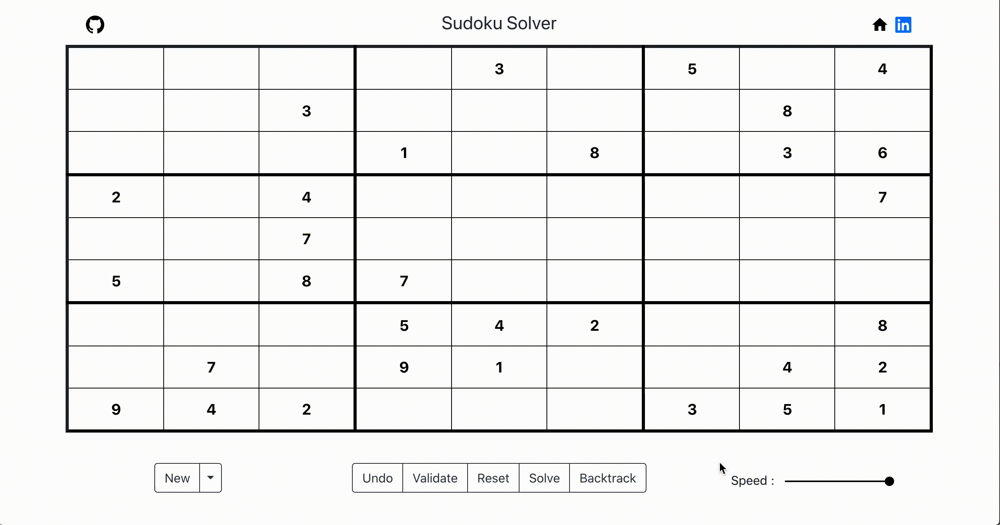
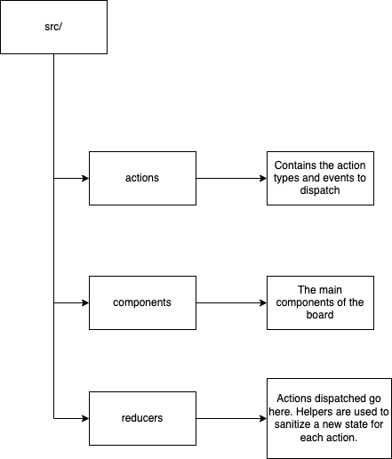

# Sudoku Solver

Fully Interactive sudoku game that has the option to show how the backtracking algorithm works



## Getting Started

```
git clone https://github.com/husshegz/sudoku-solver.git
```

```
cd sudoku-solver
```

```
yarn
```

```
yarn start
```

### Little Blurb

The idea is that we can build a solution step by step using recursion; if during the process we realise that is not going to be a valid solution, then we stop computing that solution and we return back to the step before (backtrack).
[(link)](https://medium.com/@andreaiacono/backtracking-explained-7450d6ef9e1a)

### File Structure



## Deployment

```
yarn run deploy
```

## Built With

- [Sugoku API](https://github.com/berto/sugoku) - The web API used to generate the sudoku boards
- [React](https://reactjs.org/) - YES !
- [Redux](https://redux.js.org/) - YES !
- [React-Bootstrap](https://react-bootstrap.github.io/) - For simple main design components

## Authors

- **Hussein Hegazy** - [Personal Website](https://husshegz.github.io/)

## Acknowledgments

- All the SO's
- All the youtubes
